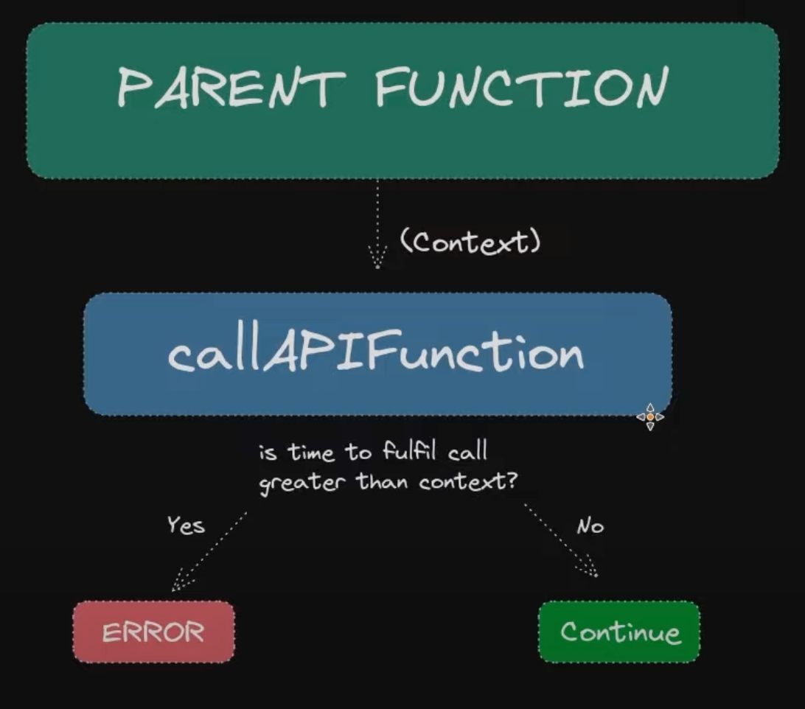

# Go context explained 

## with timeout

The main function, often main.go, is the application's entry point where the context with a timeout is declared. This context sets a deadline for the execution of the code, ensuring operations, such as API calls or database queries, complete within the specified timeout. 

If an operation exceeds the timeout, an error is triggered and returned. If it completes within the timeout, the program continues as expected. 

This mechanism prevents operations from hanging indefinitely and causing the application to become unresponsive.

In Go, `context.WithTimeout` returns a new `context` and a `cancel` function. This cancel function can be called to cancel the context before the timeout is reached.

The `defer` keyword is used to ensure that a function call is performed later in a program's execution, usually for purposes of cleanup. This is important because it ensures that any resources associated with the context are properly cleaned up, preventing potential memory leaks.